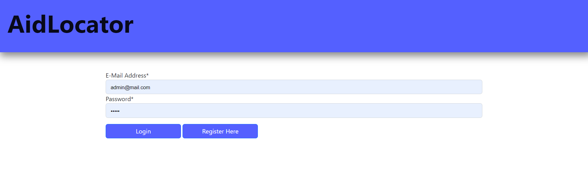
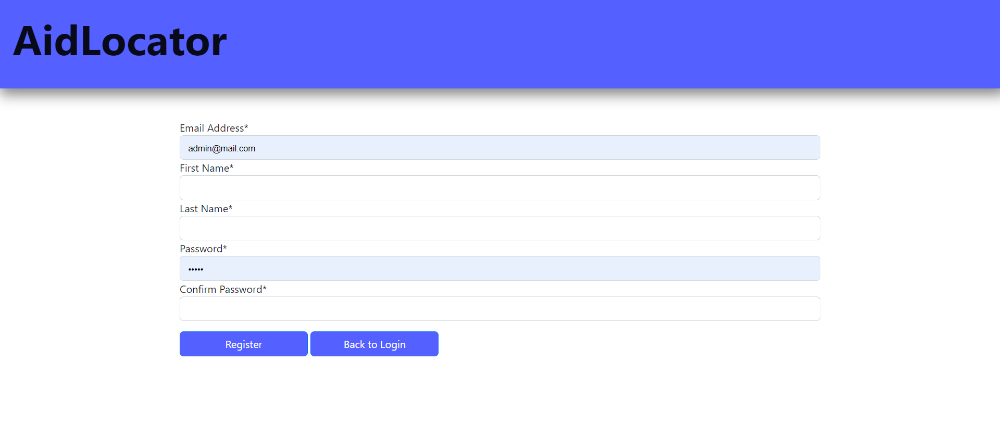
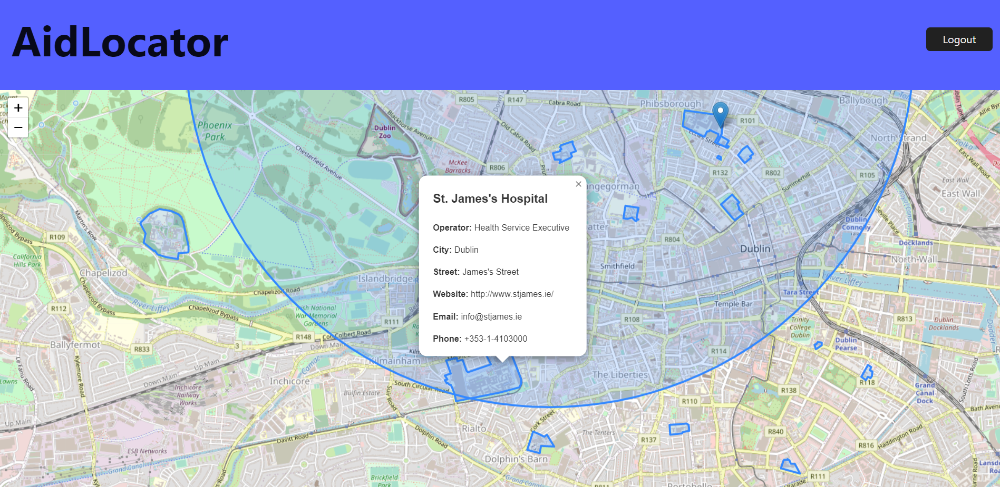
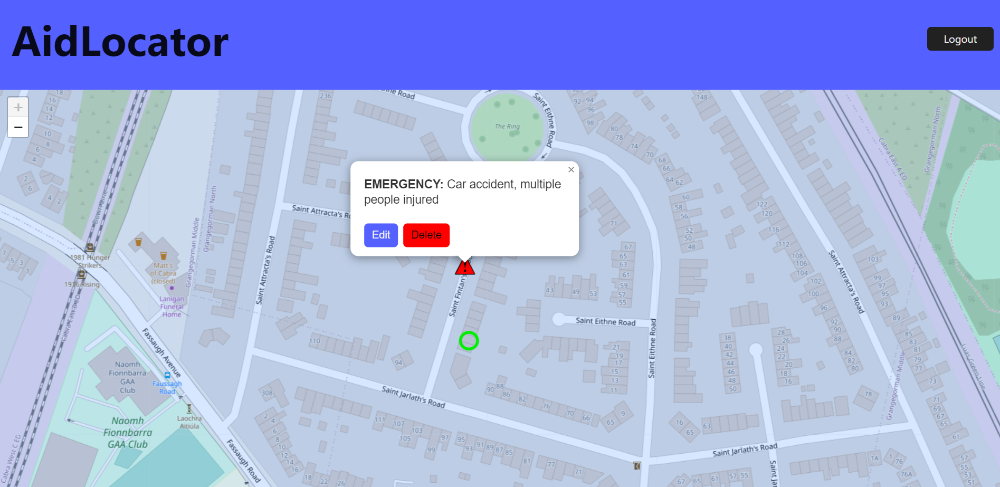

# AWM_Assignment_2

## Website Link
https://shterybai.xyz

## Deployment
In order to deploy the website, I first had to register a domain name. This was done using namecheap.com, where I registered the domain "shterybai.xyz", which is named after my GitHub account. I also had to create a Droplet on DigitalOcean with Ubuntu and Docker. I then copied the IPv4 address of the Droplet, and then went into the "Advanced DNS" section of my namecheap domain and added an "A Record" containing the droplet IP.

I then went into the droplet's console, and created:
- A network
- An nginx image
- An nginx container
- A cert within the nginx container
- A pgAdmin4 container
- A PostGIS container

Once this was done, I started each container to make sure they were working using:

```
    docker ps
```

Once I made sure each container was running, I logged into my DockerHub account and pushed my Django image to my account. I then logged onto my DockerHub account, this time within the Droplet console, and pulled my image.

```
    docker pull shterybai/wmap_assignment_image
```

With the Django image, I created a Django container with the image mounted on it. I also cd'd into wmap_nginx_certbot/conf and created two .conf files: headers, and server. I then ran all containers in order, and once again verified that they were all running successfully.

## Mapping
The user is greeted with a login page and, if they don't have an account, they can register an account. This is handled with the PgAdmin4 database container.




For mapping, I wanted to create a healthcare-related web application. This web app maps all hospitals in Ireland, using a GeoJSON file generated from overpass-turbo.eu. This file is then fetched and a Marker containing relevent JSON information is created for each hospital.



I also created a feature where the user can create their own "Emergency" marker where a medical emergency has occured. The user is then prompted to provide details about the medical emergency.


